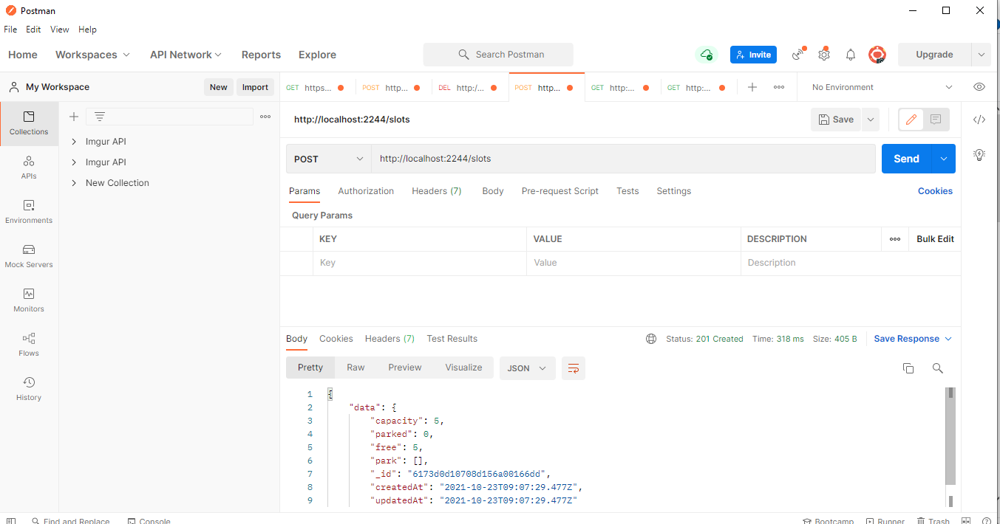
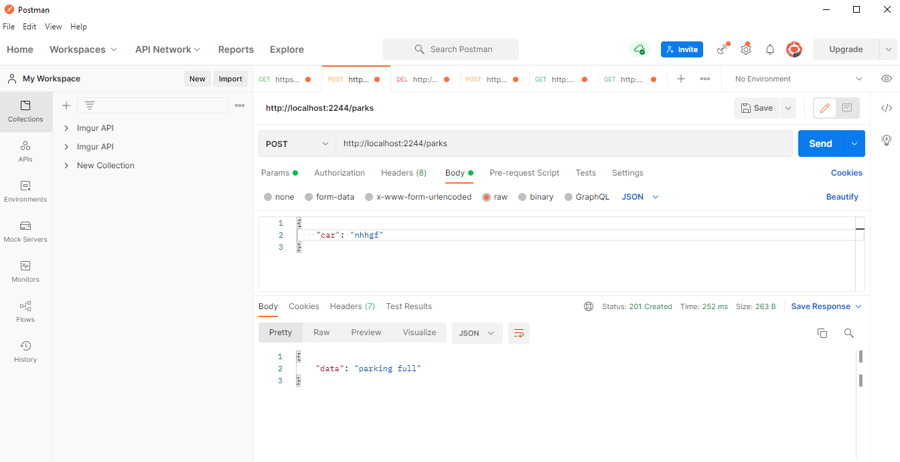
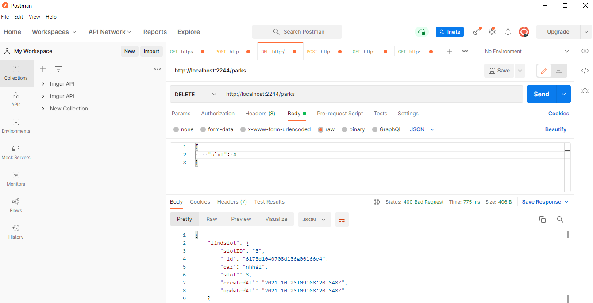
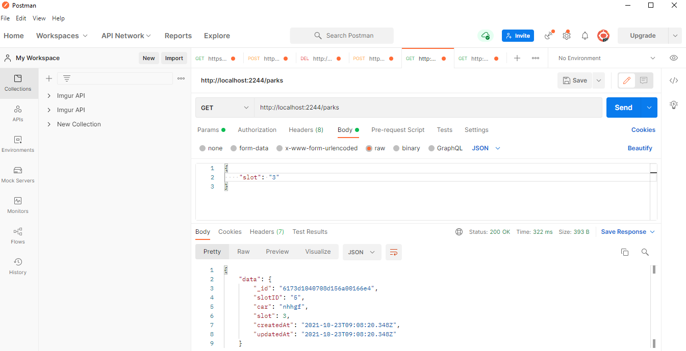

<!-- ABOUT THE PROJECT -->
## About The Project


Parking Api

### Built With

This section should list any major frameworks that you built your project using. Leave any add-ons/plugins for the acknowledgements section. Here are a few examples.
* [Express](https://expressjs.com/)
* [node](https://nodejs.org/en/)
*  [mongoDb](https://www.mongodb.com/)


<!-- GETTING STARTED -->
## Getting Started

This project is about Parking Api
 

### Installation

1. Clone the repo
   ```sh
   git clone https://github.com/ssunilkkumar/parkingapi.git
   ```
2. Install NPM packages
   ```sh
   npm install
   ```


<!-- USAGE EXAMPLES -->

## DEMO
* Add .env file and add SLOT(as per your choice) and PORT in that
  ```sh
    PORT = 2244
    SLOT = 5
   ```
* Start server
   ```sh
   npm run start
   ```
* First create slot in database by post request(this is must for using other api)
  ```sh
   http://localhost:2244/slots
   ```
   
<hr/>
* Add car in database by post request(post car number from body)

  ```sh
  http://localhost:2244/parks
  ```
   
   <hr/>
* remove car from database by delete request(send slot number you want to delete from body)

  ```sh
  http://localhost:2244/parks
   ```
   
   <hr/>
* get car or slot from server by get request(send car number or slot to get details)

  ```sh
  http://localhost:2244/parks
   ```
   
   <hr/>


<!-- CONTACT -->
## Contact

Your Name - [Sunil](https://www.linkedin.com/in/ssunilkkumar/)

Project Link: [https://github.com/ssunilkkumar/parkingapi](https://github.com/ssunilkkumar/parkingapi)
